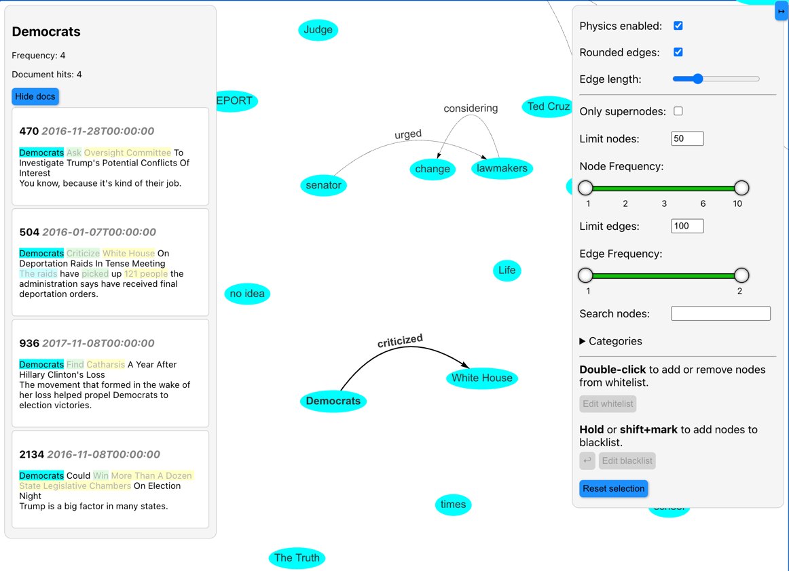

# narrativegraphs

Turn a collection of texts into an interactive narrative graph — extract entities, relationships, and explore the structure of your corpus visually.

## Installation
```bash
pip install narrativegraphs
```

## Quick Start
```python
from narrativegraphs import NarrativeGraph

docs: list[str] = [...]  # your list of documents
model = NarrativeGraph().fit(docs)
model.serve_visualizer()
```

Open the link in your terminal to explore the graph in your browser:



## Features

- **Plug'n'play solution** – get started with a few lines of code
- **Interactive browser-based visualizer** – no extra dependencies
- **See the original contexts** that entities and relations appear in
- **Customizable pipeline components** for different use cases
- **Filter and query the graph** by statistics, category, or timestamps
- **Export graph and data to NetworkX and Pandas** for custom analyses 

## Documentation

Full documentation and tutorials: [kasperfyhn.github.io/narrativegraphs](https://kasperfyhn.github.io/narrativegraphs)

## License

MIT